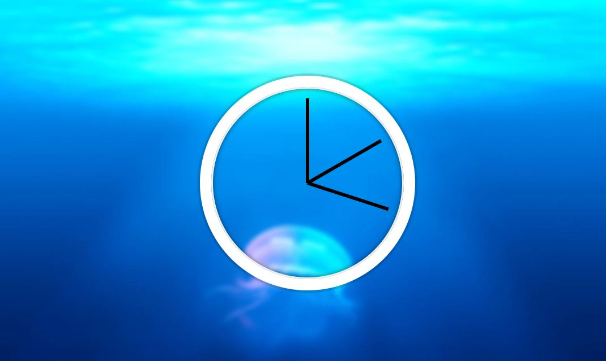

# CSS-JSWatch
 
This is project 2 in Wes Bos' JavaScript 30 course.  This week we built an analog style watch using CSS, HTML and JS. The three hands move in the way you might expect; 
seconds, minutes, and hours and have been oriented to start in the 12 o'clock position.   

